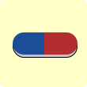

<h1 align="center">Medicine Reminder</h1>

Medicine reminder is a simple reminder app for medicine.

In simple terms it creates an object of a reminder and generates the Notification channel, Repeating alarm that shows a notification.

The Medicine Reminder is complete for the first version (skeleton) of the app.

but there is functionality that is missing such as:

    - Settings page
    - Completed reminders page
    - Mute/Unmute reminders functionality
    - Timer to next dosage
    - A home screen widget that displays the current reminders
    - improvements to navigation by using a navigation component
    - using fragments
    - separating concerns using viewModel

This functionality is planned for the next version of the app.

---

<h1  align="center">Structure</h1>

The main structure of the app is divided into several subfolders to make it easier to navigate.

The classes used are:

- Main Activity

            The main activity responsible for displaying the list of reminders and adding a reminder.

- ReminderDetails

            This activity is reponsible for displaying the details of a reminder.
            it also has dynamically generated checkboxes for the amount of doses.

- SplashActivity

            This acttivity is responsible for the splashscreen while main activity is loading.

- with folders as follows:

  - Adapters

    - CustomerAdapter

            The main page list adapter is implemented here,
            it is used to display the list of reminders.

    - databaseAdapter

            The Database logic is implemented here
            it has all the methods for the CRUD operations as well.

  - Alarms

    - AlarmHelper

            The Logic for the alarm creation and deletion(cancelation) is implemented here.

  - helperClasses

    - TimerToNextDose

            The logic for a concept timer is implemented here.
            But the feature is not implemented in the application
            due to lack of time but it will be implemented in the future.

    - Validation

            The form validation logic is implemented here,
            this class takes care of the validation of both the create reminder form and the edit reminder form.

  - Notifications

    - Message

            The Custom Toast methods are implemented here,
            this class is only responsible for showing a toast message using custom layout based
            on application needs.

    - NotificationHelper

            The logic to create a notification Channel and to build a notification is implemented here.

  - ObjectClasses

    - Alarm

            The Alarm object used in the database.

    - MedicineReminder

            The Reminder object used in the database.

  - Recievers

    - BootReciever

            The Reciever that recreates the alarms based on data from the database when the device reboots.

    - ReminderReciever

            The Reciever that creates the notification when the alarm time is reached.

  - Threads

    - AlarmThread

            Created to reduce load on the main thread.
            responsible for creating the alarm.

---

<h1 align="center">Design</h1>

The design of Medicine Reminder is made using custom widgets accompanied by material theming which also includes a dark mode that switches automatically based on system preferences.

The application also has custom font included called nunito.

All the designs are created by the author.

### Logo:

### Pages in the app:

- #### Splash Screen
     
    

---

- #### Home page
     
    

---

- #### Home page Dark Mode
     
    

---

- #### Reminder Details page
   
  

---

- #### Create Reminder Dialog
   
  

---

- #### Success message Toast
   
  

---

- #### Error message Toast
   
  

---

- #### Delete Reminder Dialog
   
  

---

- #### Edit Reminder Dialog
   
  

---
